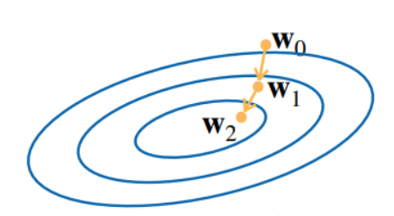
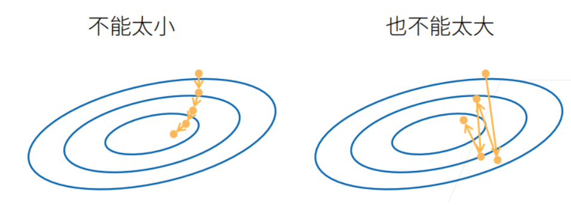

# 线性模型
- 给定 n 维输入: $\mathbf{x}  = [x_1,x_2,x_3,...x_n]^T$
- 线性模型有一个 n 维权重和一个标量偏差: $\mathbf{w}  = [w_1,w_2,w_3,...w_n]^T,\quad{b}$
- 输出是输入的加权求和: $y = w_1x_1 + w_2x_2+w_3x_3+...+w_nx_n+b$

# 损失函数
损失函数能够量化目标的实际值与预测值之间的差距。 通常我们会选择非负数作为损失，且数值越小表示损失越小，完美预测时的损失为0。

回归问题中最常用的损失函数是平方误差函数：

$$
L(\mathbf{X},y,\mathbf{w}, b) =\frac{1}{2n} \sum_{i=1}^n \left(\mathbf{w}^\top \mathbf{x}^{(i)} + b - y^{(i)}\right)^2
$$

转换成矩阵表示形式：

$$
L(\mathbf{X},y,\mathbf{w}, b) = \frac{1}{2n} \left \| \mathbf{y}-\mathbf{X}\mathbf{w}-b \right \| ^2
$$

在训练模型时，我们希望寻找一组参数 $\mathbf{w}^*, b^*$ ，这组参数能最小化在所有训练样本上的总损失。如下式：

$$
\mathbf{w}^*, b^* = \operatorname*{argmin}_{\mathbf{w}, b}\  L(\mathbf{X},\mathbf{y},\mathbf{w}, b)
$$

# 线性模型的解析解
线性回归的解可以用一个公式简单地表达出来， 这类解叫作解析解。

将偏差添加到权重中: $\mathbf{X} \longrightarrow  [\mathbf{X} ,1],\mathbf{W} \longrightarrow  [\mathbf{W},b]$

则损失函数可以表示为：

$$
L(\mathbf{X},\mathbf{y},\mathbf{w})=\frac{1}{2n} \left \| \mathbf{y}-\mathbf{X}\mathbf{w} \right \|^2 
$$

求导可得：

$$
\frac{\partial L(\mathbf{X},\mathbf{y},\mathbf{w} )}{\partial w} = \frac{1}{n}(\mathbf{y}-\mathbf{X}\mathbf{w})^T\mathbf{X}  
$$

令导数为0:

$$
\frac{\partial L(\mathbf{X},\mathbf{y},\mathbf{w} )}{\partial w} = 0\Leftrightarrow \frac{1}{n}(\mathbf{y}-\mathbf{X}\mathbf{w})^T\mathbf{X}=0\Leftrightarrow\mathbf{w^*}=(\mathbf{X}^T\mathbf{X})^{-1}\mathbf{X}^T\mathbf{y}
$$

像线性回归这样的简单问题存在解析解，但并不是所有的问题都存在解析解。 解析解可以进行很好的数学分析，但解析解对问题的限制很严格，导致它无法广泛应用在深度学习里。


# 随机梯度下降
梯度下降几乎可以优化所有深度学习模型。它通过不断地在损失函数递减的方向上更新参数来降低误差。

梯度下降最简单的用法是计算损失函数（数据集中所有样本的损失均值）关于模型参数的导数（在这里也可以称为梯度），沿着梯度方向会增加损失函数值，所以参数更新使用梯度的负方向。



- 挑选一个初始值 $\mathbf{w_0}$
- 重复迭代参数:

$$
\mathbf{w_t}=\mathbf{w_{t-1}}-\eta \frac{\partial L}{\partial \mathbf{w}_{t-1}} 
$$

- 超参数：$\eta$ 称为学习率，需要手动指定，像这种可以调整但不在训练过程中更新的参数称为超参数。
- 调参：就是选择超参数的过程。 超参数通常是我们根据训练迭代结果来调整的
- 学习率需要选择合适的值:
    - 学习率太小，会导致收敛速度慢
    - 学习率太大，将会导致震荡：



# 小批量随机梯度下降
在整个训练数据集上计算梯度实际执行过程中会非常慢，因为在每一次更新参数之前，必须遍历整个训练数据集。 因此，我们通常会在每次需要计算更新的时候随机抽取一小批样本， 这种变体叫做小批量随机梯度下降。

在每次迭代中，我们首先随机抽样一个小批量 $\mathcal{B}$，它是由固定数量的训练样本组成的。 然后，我们计算小批量的平均损失关于模型参数的导数（也可以称为梯度）。最后同样乘以学习率，并从当前参数值中减掉。

$$
\mathbf{w_t}=\mathbf{w_{t-1}}-\frac{\eta}{\mathcal{B}}  \frac{\partial L}{\partial \mathbf{w}_{t-1}} 
$$

- 批量大小需要选择合适的值:
    - 批量太小，每次计算量太小，不能合理的利用计算资源
    - 批量太大，内存消耗增加，浪费计算(例如存在样本相同的情况)

# 线性回归 pytorch 的基础实现
```

```

# 线性回归 pytorch 的简洁实现